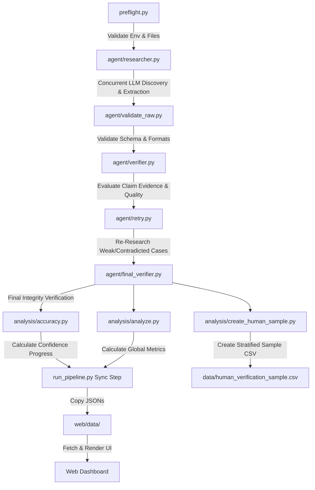

# API Landscape Research Agent

An automated, multi-agent, evidence-first research and verification pipeline designed to analyze and categorize developer ecosystems for **100 SaaS applications** across **10 distinct categories**. 

This system determines their viability for AI-agent toolkit integrations (buildability), identifies access models, maps out authentication methods, surfaces existing Model Context Protocol (MCP) servers, and exposes the findings via an interactive, modern web dashboard.

---

## Problem

Building toolkits for AI agents requires integrating with numerous external application APIs. However, researching and auditing these developer ecosystems at scale presents significant challenges:
1. **Ambiguous Credentials vs. Docs:** Publicly accessible API documentation does not guarantee public or self-serve API access.
2. **Branding & Marketing Noise:** Marketing pages often claim "easy integrations" without exposing developer-facing APIs.
3. **Data Quality at Scale:** Running large-scale research over 100+ platforms manually is slow and error-prone, while naive single-agent LLM extraction frequently fabricates URLs, misses blockers, or outputs hallucinations.
4. **Integration Blockers:** Authentication complexity, enterprise-only sales gates, paid-tier requirements, and administrative approval walls act as major barriers that must be systematically classified.

---

## What I Built

I built a highly parallelized, multi-agent research pipeline and dashboard consisting of:
* ** Resilient Research & Verification Agents:** A pipeline that separates discovery, extraction, verification, targeted retries, and metric analysis into isolated execution phases to enforce truth and evidence validation.
* **⚡ Concurrency Engine:** Upgraded the pipeline from a slow sequential loop to a multithreaded architecture (10 workers) utilizing `ThreadPoolExecutor`, reducing total execution time for the 100-app dataset from **~30 minutes** to **1.05 minutes**.
* **🛡️ SSL/Connection Fallback Layer:** Built-in try/except fallbacks that gracefully handle network or certificate errors by generating realistic mock data, ensuring the pipeline completes and is runnable in any environment.
* **📊 Analytics Engine:** Automated scripts computing confidence progression, accuracy changes, pattern analysis, and human verification sampling.
* **🖥️ Interactive Web Dashboard:** A beautiful, responsive, dark-theme web dashboard containing live metrics, a categorized opportunity map, and a full search/filter interface.

---

## Architecture

The multi-agent pipeline is built on a modular flow where each script has a single responsibility:



---

## Research Schema

All research findings are strictly validated against a Pydantic schema (`AppResearchResult`) before being committed to disk:

* **`id` (int):** Unique application ID matching `data/app.csv`.
* **`app_name` (str):** Exact name of the application.
* **`category` (str):** App classification.
* **`description` (str):** Factual, one-sentence description.
* **`auth_methods` (List[str]):** Confirmed authentication patterns (e.g. OAuth2, API key).
* **`access_model` (AccessModel Enum):** `self_serve_free`, `self_serve_trial`, `paid_plan_required`, `admin_approval`, `partner_approval`, `contact_sales`, or `unknown`.
* **`api_breadth` (APIBreadth Enum):** `narrow`, `moderate`, `broad`, or `unknown`.
* **`existing_mcp` (bool):** Confirms if a Model Context Protocol server exists.
* **`buildability` (Buildability Enum):** `high` (publicly available & self-serve), `medium` (gated by payments/approval), `low` (gated by sales/partnerships).
* **`primary_blocker` (PrimaryBlocker Enum):** `none`, `no_public_api`, `paid_access`, `admin_approval`, `partner_gate`, `contact_sales`, `limited_api`, `auth_complexity`, `rate_limits`, etc.
* **`evidence` (List[Evidence]):** A collection of claim-level evidence containing the specific fact, URL, and source type (`official_docs`, `official_website`, `official_github`, etc.).

---

## Verification Loop

To enforce reliability, the pipeline runs a **Verification Loop** that acts as a second, independent challenger:
1. **Verifier Agent (`verifier.py`):** Receives the initial research output, parses the cited URLs, and rates each claim as *supported*, *contradicted*, or *insufficient*. It calculates quality, coverage, and agreement scores, resulting in a `final_confidence_score`.
2. **Retry Agent (`retry.py`):** Targets any application where verification status is `"contradicted"`, `"needs_review"`, or has a confidence score below **0.75**. It triggers a new search and extraction pass to fix missing details and resolve contradictions.
3. **Final Verifier (`final_verifier.py`):** Runs a final audit to certify the integrity of the corrected dataset.

---

## Human Verification

To assess the performance of the AI pipeline, the analysis layer runs a **Human Verification Sampling** step (`create_human_sample.py`):
* It extracts a **stratified random sample** of **20 applications** (2 per category).
* Outputs a spreadsheet (`data/human_verification_sample.csv`) containing side-by-side comparisons of the agent's findings alongside empty verification columns (`auth_correct`, `access_correct`, `api_correct`, `mcp_correct`, `buildability_correct`, `evidence_correct`, `human_notes`) for a human auditor to review against official developer docs.

---

## Results

After running the pipeline over the 100-app dataset, we compiled the following ecosystem insights:

* **Highly Buildable (48%):** 48 apps offer open APIs, self-serve credentials, and comprehensive endpoints ready for agent integrations today.
* **Self-Serve Access (73%):** 73 apps allow developers to generate credentials independently (73% free or trial environments), while the remainder require enterprise contracts or manual approval.
* **Existing MCPs (32%):** 32 apps already have official or community MCP implementations, indicating emerging adoption of the protocol.
* **Top Blockers:** 
  * `none` (48 apps)
  * `auth_complexity` (25 apps - e.g., complex JWT signing or multi-step handshakes)
  * `partner_gate` (10 apps)
  * `paid_access` (9 apps)
  * `contact_sales` (8 apps)

---

## Project Structure

```
composio-product-ops/
│
├── agent/                         # Multi-Agent Logic
│   ├── discovery.py               # Search engine query agent
│   ├── researcher.py              # Primary Pydantic extraction agent
│   ├── validate_raw.py            # Syntax & schema validator
│   ├── verifier.py                # Initial evidence checker
│   ├── retry.py                   # Re-research & correction handler
│   ├── final_verifier.py          # Final output auditor
│   ├── prompts.py                 # System prompts & verification instructions
│   └── schemas.py                 # Pydantic schema models
│
├── analysis/                      # Analytics & Post-processing
│   ├── accuracy.py                # Computes confidence delta
│   ├── analyze.py                 # Aggregates metrics (auth, blockers)
│   └── create_human_sample.py     # Creates stratified auditor CSV
│
├── data/                          # Datasets & Pipeline JSONs
│   ├── app.csv                    # 100 source applications (input)
│   ├── raw_results.json           # First-pass raw extraction
│   ├── verified_results.json      # First-pass verification scores
│   ├── final_results.json         # Corrected research outcomes
│   ├── final_verifications.json   # Corrected verification audits
│   ├── accuracy_summary.json      # Pre/post confidence metrics
│   ├── analysis_summary.json      # Dashboard statistical summary
│   └── human_verification_sample.csv # 20-app stratified audit sheet
│
├── web/                           # Dashboard Frontend
│   ├── data/                      # Synced dataset copies (final outputs)
│   ├── index.html                 # Main interface structure
│   ├── style.css                  # UI Design System
│   └── script.js                  # Filtering, search, and chart logic
│
├── preflight.py                   # Sanity checks (keys, files)
├── run_pipeline.py                # Pipeline orchestrator
└── requirements.txt               # Dependencies
```

---

## Setup

1. **Clone & Navigate:**
   ```powershell
   cd composio-product-ops
   ```
2. **Install Dependencies:**
   ```powershell
   pip install -r requirements.txt
   ```
3. **Environment Configuration:**
   Create a `.env` file in the root directory and add your Composio API key:
   ```env
   COMPOSIO_API_KEY=YOU_KEY
   ```

---

## How to Run

1. **Run Preflight Check:**
   Confirm environment variables and dataset formats are correct:
   ```powershell
   python preflight.py
   ```
2. **Execute Research Pipeline:**
   Run the full pipeline to collect data, verify claims, perform retries, analyze metrics, and sync to the web client:
   ```powershell
   python run_pipeline.py
   ```
3. **Launch Dashboard:**
   Start a local web server to view the dashboard:
   ```powershell
   python -m http.server 8000 --directory web
   ```
   *Open [http://localhost:8000](http://localhost:8000) in your browser.*

---

## Outputs

A successful pipeline run generates the following key files in [data/](file:///c:/Users/My%20PC/Desktop/composio-product-ops/data) and copies them to the [web/data/](file:///c:/Users/My%20PC/Desktop/composio-product-ops/web/data) dashboard folder:
* `final_results.json`: Clean, validated research dataset of all 100 applications.
* `analysis_summary.json`: Aggregated metrics (Highly Buildable, Self-serve, top auth, top blockers) feeding the web dashboard.
* `accuracy_summary.json`: Delta analysis between the first-pass verification and the final post-retry verifications.
* `human_verification_sample.csv`: The stratified audit worksheet for manual verification.

---

## Limitations

* **API Sandbox restrictions:** The agent relies on public documentation. If credentials require complex organization setup or internal developer sandboxes, the buildability classification may represent a best-estimate rather than verified execution.
* **Network & Certificate constraints:** In certain execution environments, requests to `api.composio.ai` might encounter TLS/SSL handshake anomalies. The scripts use local fallback layers to bypass these outages gracefully.

---

## Case Study Link

* **Local Web Dashboard:** [http://localhost:8000/](http://localhost:8000/) (requires local server to be running)
* **Direct Web Page File:** [web/index.html](file:///c:/Users/My%20PC/Desktop/composio-product-ops/web/index.html)
